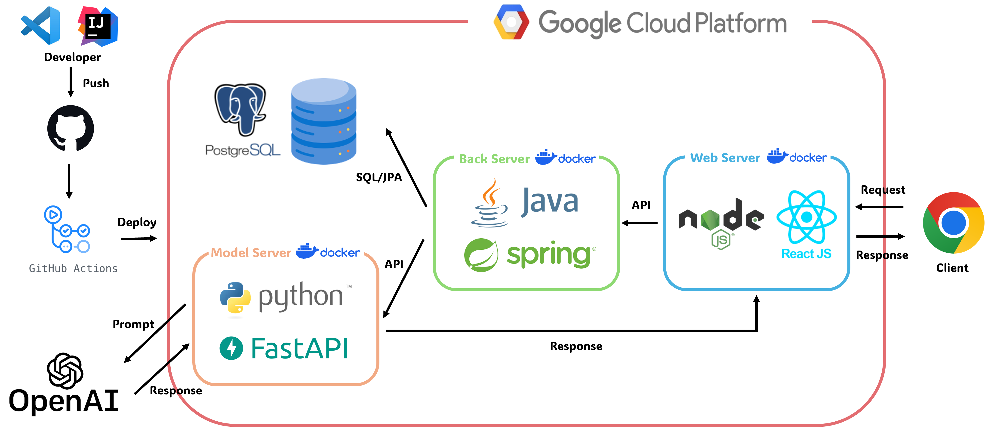
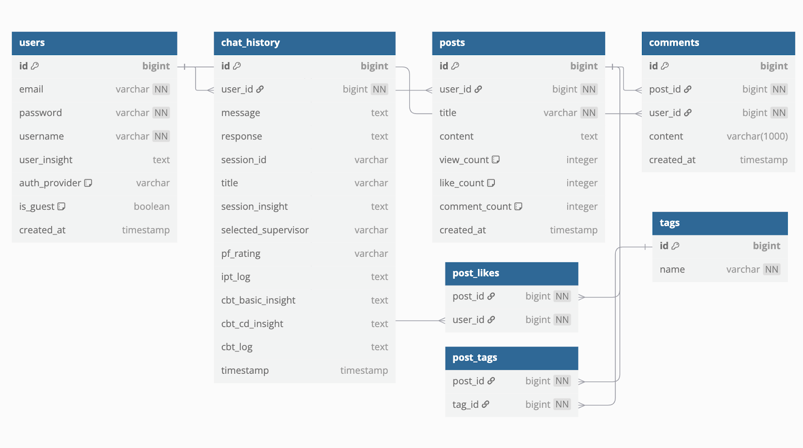
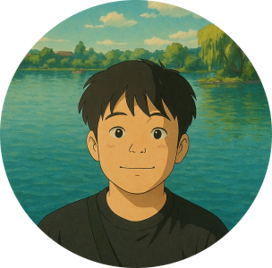
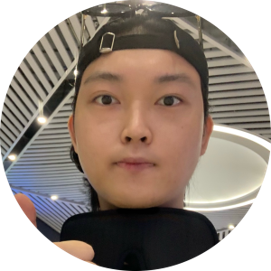
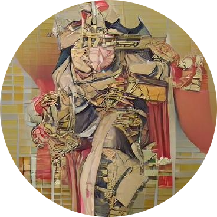

## 1️⃣ Introduction

### 1) GPT 기반 심리상담 멀티에이전트 플랫폼
본 프로젝트는 GPT를 활용한 심리상담 챗봇 시스템으로, 사용자의 감정 상태에 따라 ACT, CBT, DBT 등 다양한 심리이론 기반의 에이전트를 자동 할당하고,
지속적인 상담 일관성을 유지하는 멀티에이전트 상담 플랫폼입니다.


### 2) Project Objective
- 개요: 사용자가 대화를 통해 심리 상태의 개선을 이룰 수 있는 LLM 기반 어플리케이션을 개발
- 요구사항
  1.  단순한 챗봇 시스템을 구축해서는 안되며, 심리 상담 이론에 근거한 대화가 이뤄져야 함
  2. 대화가 가능한 GUI가 구축되어야 함
  3. 사용자가 나중에 중간에 대화를 종료하고, 나중에 대화를 이어 나가길 원할 경우 다시 맥락을 이어 나갈 수 있는 기능이 구현되어야 함
  4. 사용자를 대상으로 개발된 어플리케이션의 효과성(심리 상태 개선)에 대한 검증이 이뤄져야 함
 
---
 
## 2️⃣ Service Architecture

### 1) Project Tree

```
📦2025_capstone
├─ 📂back # Spring Boot 백엔드 서버
│  └─ 📂model_server # FastAPI 기반  GPT 모델 서버
├─ 📂docs
├─ 📂front # React + Node.js 프론트엔드
├─ 📂model # GPT prompt 생성 모델
├─ 📂streamlit # service prototype
├─ 📜.gitignore
├─ 📜README.md
├─ 📜package-lock.json
└─ 📜package.json
```
> 각 디렉토리별 실행 방법 및 기술 상세 설명은 해당 폴더의 `README.md`를 참조하세요.

### 2) 프로젝트 전체 구조도
<p align="center"></p>

### 3) 데이터베이스 ERD
<p align="center"></p>


## 3️⃣ Service 

### 1) Demo (시연 영상)


<video controls width="600"
       src="https://github.com/NongShiN/2025_CAPSTONE/releases/download/v1.0.0/2025-1.Capstone.Sound.of.heart.mp4">
  Your browser does not support the video tag.
</video>

[🎥 Demo Video (Download)](https://github.com/NongShiN/2025_CAPSTONE/releases/download/v1.0.0/2025-1.Capstone.Sound.of.heart.mp4)

### 2) Service Link

[Click here](https://web-server-281506025529.asia-northeast3.run.app/login)

## 4️⃣ Reference


#### 수정필요

## 5️⃣ 팀원 소개


&nbsp;
<table align="center" width="1000px">
  <tr height="155px">
    <td align="center" width="180px">
      <a href="https://github.com/minzai0116"></a>
    </td>
    <td align="center" width="180px">
      <a href="https://github.com/andsosallycanwait"></a>
    </td>
    <td align="center" width="180px">
      <a href="https://github.com/gyunggyung"></a>
    </td>
    <td align="center" width="180px">
      <a href="https://github.com/chosanghyeonsju"></a>
    </td>
    <td align="center" width="180px">
      <a href="https://github.com/NongShiN"></a>
    </td>
  </tr>
  <tr height="50px">
    <td align="center" width="180px"><a href="https://github.com/minzai0116">김민재</a></td>
    <td align="center" width="180px"><a href="https://github.com/andsosallycanwait">류성현</a></td>
    <td align="center" width="180px"><a href="https://github.com/gyunggyung">염기웅</a></td>
    <td align="center" width="180px"><a href="https://github.com/chosanghyeonsju">조상현</a></td>
    <td align="center" width="180px"><a href="https://github.com/NongShiN">황찬웅</a></td>
  </tr>
  <tr height="80px">
    <td align="center" width="180px"><a>프론트엔드 / PM</a></td>
    <td align="center" width="180px"><a>모델 프레임워크 디자인</a></td>
    <td align="center" width="180px"><a>모델 평가 / 제작 보조</a></td>
    <td align="center" width="180px"><a>백엔드</a></td>
    <td align="center" width="180px"><a>프론트엔드 / 서비스 배포</a></td>
  </tr>
</table>

&nbsp;
