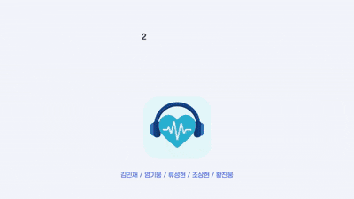
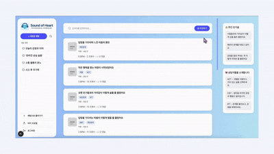
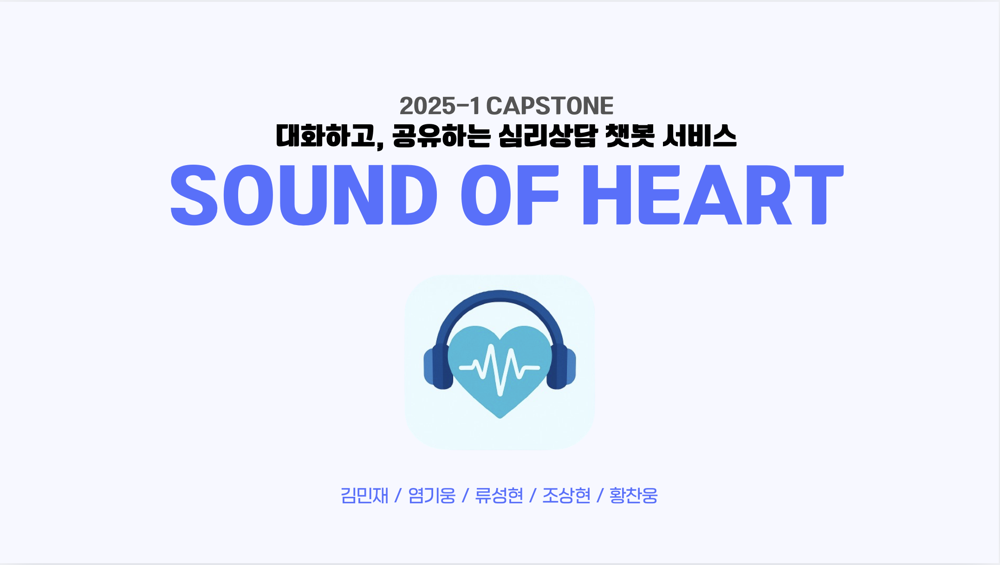
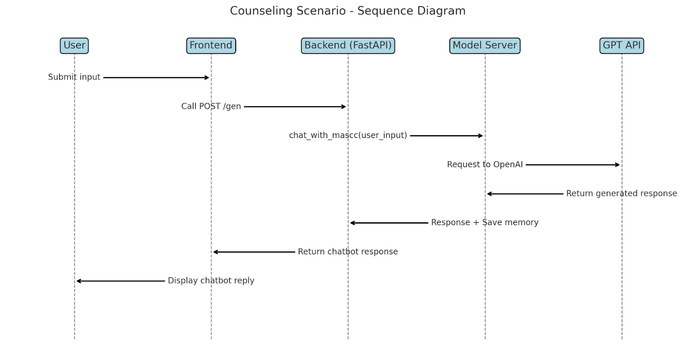
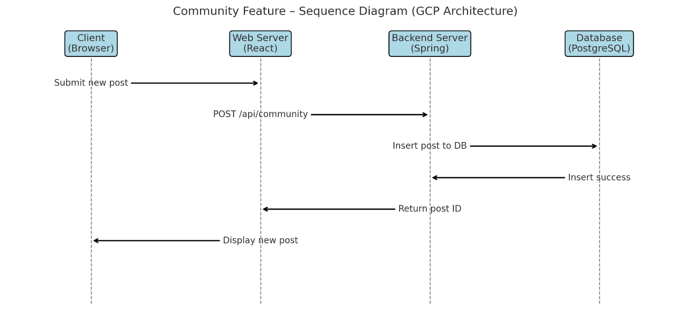

## 1️⃣ Introduction

### 1.1. GPT 기반 심리상담 멀티에이전트 플랫폼
**AI 심리상담 챗봇**은 사용자의 감정, 고민, 심리적 어려움을 자연어로 입력받아 이를 분석하고,  
다양한 상담 이론(CBT, ACT, DBT 등)을 바탕으로 정서적으로 반응하며 구조화된 대화를 제공하는 심리상담 지원 시스템입니다.

본 프로젝트는 GPT 기반의 언어모델을 활용하여 전문가 수준의 상담 스타일을 재현하며,  
정량적 지표와 실험 설계를 통해 각 접근법의 효과성을 검증하는 데에도 초점을 맞추고 있습니다.


### 1.2. Project Objective
- 인지행동치료(CBT), 수용전념치료(ACT), 변증법적 행동치료(DBT)에 기반한 상담 스타일 구현
- A/B 테스트를 통한 상담 전략 효과 비교
- 실시간 대화 로그 저장 및 CTRS 기반의 정량적 평가
- 익명 커뮤니티 기능을 통한 감정 공유 및 심리적 연대감 형성
- 접근성 높은 초기 심리지원 및 정서 해소 도구로의 활용


### 1.3. 주요 기능

| 기능 | 설명 |
|------|------|
| 🎙️ 감정 기반 대화 | 사용자의 입력을 분석하여 적절한 상담 전략 적용 |
| 🧠 전략별 응답 | CBT/ACT/DBT 이론에 따라 정서적 공감 및 과제 제시 |
| 📊 실시간 로그 분석 | 대화 내용 저장 및 피드백 수집, 전략별 효과 평가 |
| 👥 익명 커뮤니티 | 사용자 간 고민 공유 및 공감 기능 |
| 🔄 A/B 테스트 | 전략별 효과성과 사용성에 대한 실험 설계 도입 |

 
## 2️⃣ Service

### 2.1. Chatbot Demo

<p align="center"></p>

### 2.2. Community Demo

<p align="center"></p>

### 2.3. 발표 영상

<p align="center">
  <a href="https://youtu.be/k7hscH6lCtU" target="_blank">
    
  </a>
</p>


### 2.4. Service Link

[Click here](https://web-server-281506025529.asia-northeast3.run.app/login)


## 3️⃣ Service Architecture

### 3.1. Project Tree

```
📦2025_capstone
├─ 📂back # Spring Boot 백엔드 서버
│  └─ 📂model_server # FastAPI 기반  GPT 모델 서버
├─ 📂docs
├─ 📂front # React + Node.js 프론트엔드
├─ 📂model # GPT prompt 생성 모델
├─ 📂streamlit # service prototype
├─ 📜.gitignore
├─ 📜README.md
├─ 📜package-lock.json
└─ 📜package.json
```
> 각 디렉토리별 실행 방법 및 기술 상세 설명은 해당 폴더의 `README.md`를 참조하세요.

### 3.2. Project Architecture
<p align="center"></p>

ㅤㅤㅤㅤ• 프론트/백엔드/모델 서버 → 각각 Docker → GCP Cloud Run


ㅤㅤㅤㅤ• PostgreSQL → GCP Cloud SQL

ㅤㅤㅤㅤ• GitHub Actions: Push → Docker Build → Artifact Registry → Cloud Run Deploy


### 3.3. ERD
<p align="center"></p>


### 3.4. Scenario


#### 3.4.1. Counseling Scenario
<p align="center"></p>

#### 3.4.2. Community Scenario
<p align="center"></p>

## 4️⃣ 팀원 소개


&nbsp;
<table align="center" width="1000px">
  <tr height="155px">
    <td align="center" width="180px">
      <a href="https://github.com/minzai0116"></a>
    </td>
    <td align="center" width="180px">
      <a href="https://github.com/andsosallycanwait"></a>
    </td>
    <td align="center" width="180px">
      <a href="https://github.com/gyunggyung"></a>
    </td>
    <td align="center" width="180px">
      <a href="https://github.com/chosanghyeonsju"></a>
    </td>
    <td align="center" width="180px">
      <a href="https://github.com/NongShiN"></a>
    </td>
  </tr>
  <tr height="50px">
    <td align="center" width="180px"><a href="https://github.com/minzai0116">김민재</a></td>
    <td align="center" width="180px"><a href="https://github.com/andsosallycanwait">류성현</a></td>
    <td align="center" width="180px"><a href="https://github.com/gyunggyung">염기웅</a></td>
    <td align="center" width="180px"><a href="https://github.com/chosanghyeonsju">조상현</a></td>
    <td align="center" width="180px"><a href="https://github.com/NongShiN">황찬웅</a></td>
  </tr>
  <tr height="80px">
    <td align="center" width="180px"><a>프론트엔드 / PM</a></td>
    <td align="center" width="180px"><a>모델링</a></td>
    <td align="center" width="180px"><a>모델링</a></td>
    <td align="center" width="180px"><a>백엔드</a></td>
    <td align="center" width="180px"><a>프론트엔드 / 서비스 배포</a></td>
  </tr>
</table>

&nbsp;
