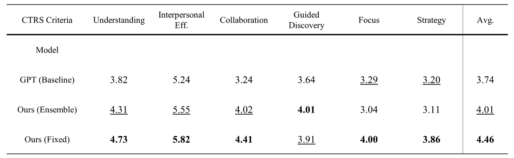
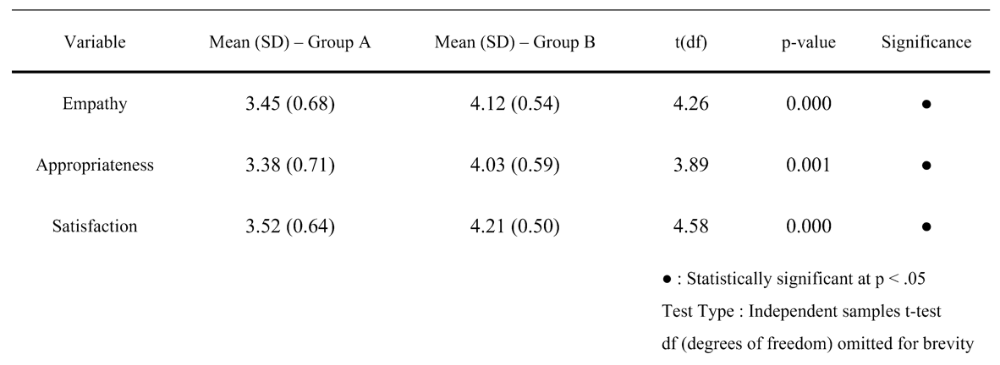

## 1️⃣ Introduction

### 1.1. GPT 기반 심리상담 멀티에이전트 플랫폼
**AI 심리상담 챗봇**은 사용자의 감정, 고민, 심리적 어려움을 자연어로 입력받아 이를 분석하고,  
다양한 상담 이론(CBT, ACT, DBT 등)을 바탕으로 정서적으로 반응하며 구조화된 대화를 제공하는 심리상담 지원 시스템입니다.

본 프로젝트는 GPT 기반의 언어모델을 활용하여 전문가 수준의 상담 스타일을 재현하며,  
정량적 지표와 실험 설계를 통해 각 접근법의 효과성을 검증하는 데에도 초점을 맞추고 있습니다.


### 1.2. Project Objective
- 인지행동치료(CBT), 수용전념치료(ACT), 변증법적 행동치료(DBT)에 기반한 상담 스타일 구현
- A/B 테스트를 통한 상담 전략 효과 비교
- 실시간 대화 로그 저장 및 CTRS 기반의 정량적 평가
- 익명 커뮤니티 기능을 통한 감정 공유 및 심리적 연대감 형성
- 접근성 높은 초기 심리지원 및 정서 해소 도구로의 활용


### 1.3. 주요 기능

| 기능 | 설명 |
|------|------|
| 🎙️ 감정 기반 대화 | 사용자의 입력을 분석하여 적절한 상담 전략 적용 |
| 🧠 전략별 응답 | CBT/ACT/DBT 이론에 따라 정서적 공감 및 과제 제시 |
| 📊 실시간 로그 분석 | 대화 내용 저장 및 피드백 수집, 전략별 효과 평가 |
| 👥 익명 커뮤니티 | 사용자 간 고민 공유 및 공감 기능 |
| 🔄 A/B 테스트 | 전략별 효과성과 사용성에 대한 실험 설계 도입 |

 
## 2️⃣ Service Architecture

### 2.1. Project Tree

```
📦2025_capstone
├─ 📂back # Spring Boot 백엔드 서버
│  └─ 📂model_server # FastAPI 기반  GPT 모델 서버
├─ 📂docs
├─ 📂front # React + Node.js 프론트엔드
├─ 📂model # GPT prompt 생성 모델
├─ 📂streamlit # service prototype
├─ 📜.gitignore
├─ 📜README.md
├─ 📜package-lock.json
└─ 📜package.json
```
> 각 디렉토리별 실행 방법 및 기술 상세 설명은 해당 폴더의 `README.md`를 참조하세요.

### 2.2. Project Architecture
<p align="center"></p>

ㅤㅤㅤㅤ• 프론트/백엔드/모델 서버 → 각각 Docker → GCP Cloud Run


ㅤㅤㅤㅤ• PostgreSQL → GCP Cloud SQL

ㅤㅤㅤㅤ• GitHub Actions: Push → Docker Build → Artifact Registry → Cloud Run Deploy


### 2.3. ERD
<p align="center"></p>


### 2.4. Scenario


#### 2.4.1. Counseling Scenario
<p align="center"></p>

#### 2.4.2. Community Scenario
<p align="center"></p>


## 3️⃣ Service 

### 3.1. 발표 영상

<p align="center">
  <a href="https://youtu.be/k7hscH6lCtU" target="_blank">
    
  </a>
</p>


### 3.2. Service Link

[Click here](https://web-server-281506025529.asia-northeast3.run.app/login)

## 4️⃣ Performance Evaluation

본 프로젝트에서는 개발한 다중 에이전트 기반 심리상담 챗봇의 효과성을  
① 전문가 기준의 정량 평가(CTRS)와 ② 사용자 기반 A/B 테스트 실험을 통해 종합적으로 검증하였습니다.

---

### 4.1. 전문가 기반 정량 평가: CTRS (Cognitive Therapy Rating Scale)

- **CTRS**는 심리상담 품질을 평가하는 국제 표준 도구로,  
  치료사의 상담 기법 수행을 0~6점 척도로 정량화합니다.
- 총 **450개의 시나리오 기반 상담 세션**에 대해 평가를 실시하였습니다.

<p align="center"></p>

📌 평가 항목:
1. 이해 (Understanding)  
2. 대인관계 효과성 (Interpersonal Effectiveness)  
3. 협력성 (Collaboration)  
4. 유도적 발견 (Guided Discovery)  
5. 집중 (Focus)  
6. 전략 (Strategy)


<p align="center"></p>

✅ **결과 요약:**
- 두 개선된 모델 버전 모두 **GPT-4o-mini 베이스라인보다 높은 점수**를 기록
- 특히 **Fixed Supervisor 방식**은 Guided Discovery 제외 전 항목에서 최고 점수
- 평균적으로 **베이스라인 대비 19.25% 성능 향상**
- 단순한 전략 병합(Ensemble)보다 **초기 정보 기반의 고정 전략 선택이 더 효과적**

---

### 4.2. 사용자 기반 A/B 테스트: 챗봇 구조 비교 실험

총 **83명의 실제 사용자** 를 대상으로,  
**고정 상담자 구조(Group A)** 와 **동적 supervisor 선택 구조(Group B)** 의 효과성을 비교 평가하였습니다.

<p align="center"></p>

📌 평가 항목 (5점 척도):
1. 공감도  
2. 응답의 적절성  
3. 전반적인 상담 만족도

<p align="center"></p> 

✅ **결과 요약:**
- **Group B (동적 supervisor)** 가 **모든 항목에서 Group A보다 더 높은 평균 점수** 획득
- **세 항목 모두 p < .05 수준의 통계적으로 유의미한 차이**
- 사용자들은 동적 구조가 더 **개인 맞춤형이고, 공감적이며, 만족스러움**을 보고함

---

### 4.3. 결론

- **상담 전략 측면(CBT/ACT/DBT 수행력)** 에서는 **Fixed Supervisor 구조**가 가장 안정적
- **사용자 경험 측면(공감/만족도)** 에서는 **동적 Supervisor 구조** 가 더 우수

📌 따라서, 실제 시스템에서는 **시나리오 성격에 따라 구조를 선택적으로 적용하거나**,  
**초기 상담 정보와 유동적 라우팅을 조합한 하이브리드 방식이 이상적**일 수 있습니다.


## 5️⃣ 팀원 소개


&nbsp;
<table align="center" width="1000px">
  <tr height="155px">
    <td align="center" width="180px">
      <a href="https://github.com/minzai0116"></a>
    </td>
    <td align="center" width="180px">
      <a href="https://github.com/andsosallycanwait"></a>
    </td>
    <td align="center" width="180px">
      <a href="https://github.com/gyunggyung"></a>
    </td>
    <td align="center" width="180px">
      <a href="https://github.com/chosanghyeonsju"></a>
    </td>
    <td align="center" width="180px">
      <a href="https://github.com/NongShiN"></a>
    </td>
  </tr>
  <tr height="50px">
    <td align="center" width="180px"><a href="https://github.com/minzai0116">김민재</a></td>
    <td align="center" width="180px"><a href="https://github.com/andsosallycanwait">류성현</a></td>
    <td align="center" width="180px"><a href="https://github.com/gyunggyung">염기웅</a></td>
    <td align="center" width="180px"><a href="https://github.com/chosanghyeonsju">조상현</a></td>
    <td align="center" width="180px"><a href="https://github.com/NongShiN">황찬웅</a></td>
  </tr>
  <tr height="80px">
    <td align="center" width="180px"><a>프론트엔드 / PM</a></td>
    <td align="center" width="180px"><a>모델 프레임워크 디자인</a></td>
    <td align="center" width="180px"><a>모델 평가 / 제작 보조</a></td>
    <td align="center" width="180px"><a>백엔드</a></td>
    <td align="center" width="180px"><a>프론트엔드 / 서비스 배포</a></td>
  </tr>
</table>

&nbsp;
