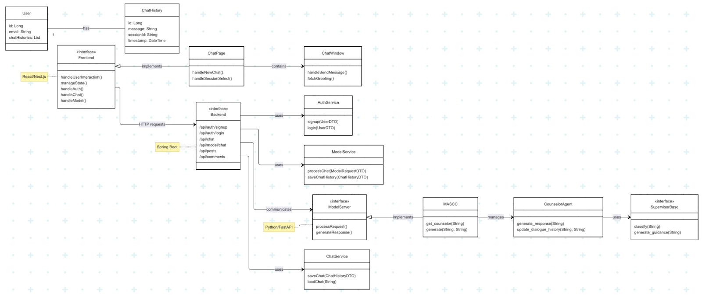

본 디렉토리는 **GPT 기반 심리상담 멀티에이전트 플랫폼**의 백엔드 코드가 포함되어 있습니다.  
Spring Boot 기반 REST API 서버로, 상담 세션 관리, 메시지 처리, LLM 연동, A/B 테스트 분기, 상담 로그 저장 등의 기능을 제공합니다.

---

## 📁 폴더 구조

```
📂back
├── 📂src
│   └── 📂main
│       ├── 📂java/com/yourorg/chatbot
│       │   ├── 📂controller      # REST API 엔드포인트
│       │   ├── 📂service         # 핵심 비즈니스 로직
│       │   ├── 📂model           # Entity, DTO 정의
│       │   ├── 📂repository      # JPA Repository 인터페이스
│       │   └── 📂config          # CORS, OpenAI 설정 등
│       └── 📂resources
│           ├── 📜application.yml # 환경 설정
│           └── 📂prompts         # 상담 전략 프롬프트 템플릿
├── 📂model_server                # 모델 서버 main, Dockerfile
├── 📜Dockerfile
├── 📜README.md
├── 📜mwnw
├── 📜mwnw.cmd
└── 📜pom.xml
```

---

## ⚙️ 실행 방법

### 🧩 1. 환경 변수 설정

`src/main/resources/application.yml` 파일에 아래 예시처럼 설정하세요:

```yaml
spring:
  datasource:
    url: jdbc:postgresql://localhost:5432/chatbot
    username: your_username
    password: your_password

openai:
  api-key: your_openai_api_key

experiment:
  ab-test-enabled: true
```

### ▶️ 2. 로컬 실행

```bash
cd back
./gradlew bootRun
```

> 서버 기본 포트: http://localhost:8080

---

## 🔌 주요 API

### 🆕 세션 생성 – POST /api/session/start

```json
{
  "userId": "anon-1234"
}
```

응답 예시:

```json
{
  "sessionId": "xyz-001",
  "agentType": "Fixed" | "Dynamic"
}
```

### 💬 사용자 메시지 전송 – POST /api/message

```json
{
  "sessionId": "xyz-001",
  "message": "요즘 불안해요."
}
```

응답 예시:

```json
{
  "response": "불안하실 수 있어요...",
  "strategy": "CBT",
  "agentType": "Dynamic"
}
```

---

## 🧠 핵심 기능

- 상담 세션 관리
- LLM (GPT-4o) 연동
- Fixed vs Dynamic Supervisor 전략 분기
- A/B 테스트 그룹 분기 및 기록
- 상담 로그 및 CTRS 평가 점수 저장

---

## 🧪 테스트

```bash
./gradlew test
```

---

## 🧱 클래스 구조도
<p align="center"></p>

## 🔧 확장 기능

- WebSocket 기반 실시간 채팅
- Redis 기반 세션 캐시
- Swagger UI API 문서 자동화
- Google/Github OAuth2 로그인 연동

---

## ⚙️ 배포 및 운영

- Docker 컨테이너 빌드 지원
- GCP Cloud Run 또는 AWS ECS 배포 가능
- GitHub Actions 기반 CI/CD 가능

---

## 🧑‍💻 팀 및 역할

| 이름   | 역할                             | GitHub          |
|--------|----------------------------------|-----------------|
| 황찬웅 | LLM-모델 연동 / 백-모델 연동 | [@NongShiN](https://github.com/NongShiN) |
| 조상현 | 백엔드 구조 설계 / 백-프론트 연동 |  [@chosanghyeonsju](https://github.com/chosanghyeonsju) |
| 김민재 | 백-프론트 연동 |  [@minzai0116](https://github.com/minzai0116)    |


---

## 📄 라이선스

본 프로젝트는 팀 졸업작품 목적의 비상업적 프로젝트로, 라이선스는 별도로 지정되어 있지 않습니다.

---

## 🙋 참고 사항

- 프론트엔드 및 모델 서버 연동 시 포트, JWT, CORS 설정 필요
- ERD 및 시스템 구성도는 루트 `docs/` 폴더 참조
