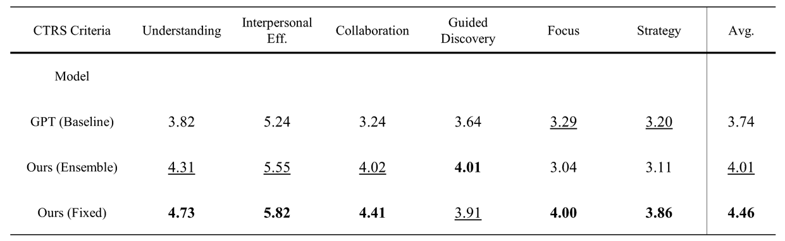
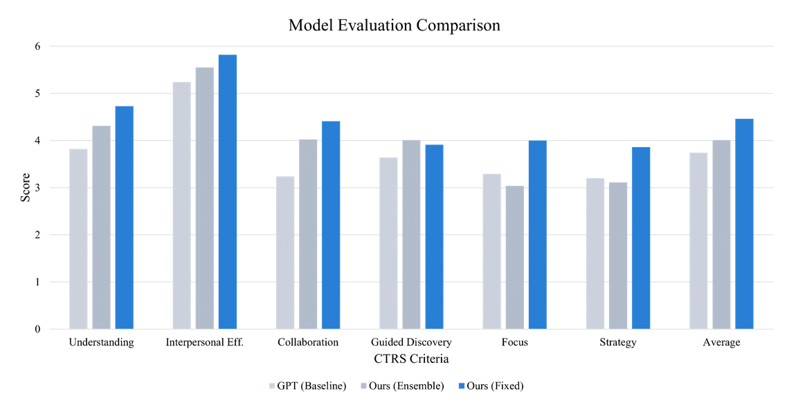
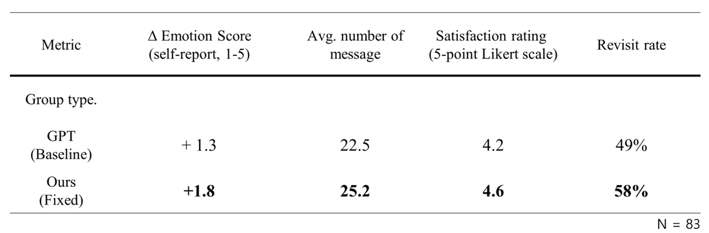
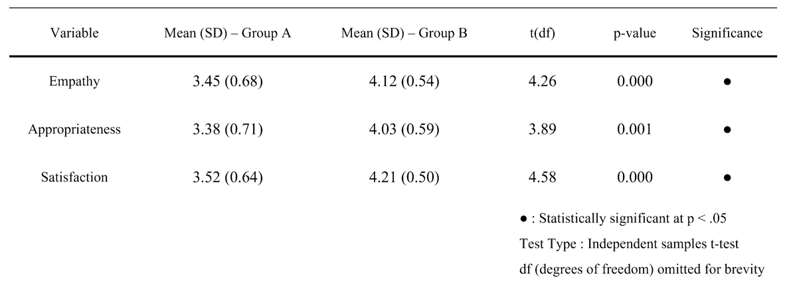

# 🧠 Model
이 디렉토리는 **GPT 기반 심리상담 멀티에이전트 플랫폼**에서 사용되는 모델 서버 코드입니다.  
다양한 상담 이론 (CBT, ACT, DBT 등)을 시뮬레이션하는 Supervisor 에이전트와 LLM 기반 전략 선택 로직이 포함되어 있습니다.

---

## 📌 핵심 개념 요약

- 🤖 **LLM 기반 상담사 프레임워크**  
  다양한 상담 이론에 기반한 에이전트를 구성하여 내담자의 상황에 맞는 전략을 선택적으로 제공.

- 🧑‍🏫 **Supervisor Agent 구조**  
  - 각 Supervisor는 특정 상담 이론(CBT, ACT, DBT 등)에 특화된 전략을 포함한 프롬프트를 포함.
  - 고정형(Fixed)과 동적 선택형(Dynamic Routing) 방식 모두 구현.
  - 실시간 사용자 입력에 따라 가장 적합한 전략을 자동 선택 가능.

- 🧠 **Prompt Engine 설계**  
  - 프리인터뷰 → 문제 인식 → 감정 반응 → 해결 유도 등 상담 단계를 구성.
  - 시간 흐름, 대화 맥락, 감정 변화를 반영하여 동적으로 prompt 조정.

- 📈 **CTRS 평가 기반 성능 검증**  
  국제적으로 공신력 있는 상담 평가 지표인 CTRS(Cognitive Therapy Rating Scale)를 통해 세부 항목별 모델 응답 평가 수행.

---

## 🧪 평가 구조 및 실험

- ✍️ **전문가 기반 정량 평가: CTRS (Cognitive Therapy Rating Scale)**  
  총 450개의 내담자 페르소나 및 시나리오 기반 대화 생성 → LLM으로 항목별 0~6점 평가.  
  세 가지 모델 구성 비교:
  1. ✅ **Baseline**: GPT-4o-mini만 사용한 단일 구조
  2. ✅ **Ensemble**: 여러 supervisor의 guidance를 통합한 프롬프트 기반 응답
  3. ✅ **Fixed**: 세션 단위 supervisor 고정

  → Fixed 구조가 6개 항목 중 5개에서 가장 높은 평균 점수 기록 (베이스라인 대비 약 19.25% 향상)

<p align="center"></p>

📌 평가 항목:
1. 이해 (Understanding)  
2. 대인관계 효과성 (Interpersonal Effectiveness)  
3. 협력성 (Collaboration)  
4. 유도적 발견 (Guided Discovery)  
5. 집중 (Focus)  
6. 전략 (Strategy)


<p align="center"></p>

✅ **결과 요약:**
- 두 개선된 모델 버전 모두 **GPT-4o-mini 베이스라인보다 높은 점수**를 기록
- 특히 **Fixed Supervisor 방식**은 Guided Discovery 제외 전 항목에서 최고 점수
- 평균적으로 **베이스라인 대비 19.25% 성능 향상**
- 단순한 전략 병합(Ensemble)보다 **초기 정보 기반의 고정 전략 선택이 더 효과적**

---


- 👥 **A/B 테스트**  
총 **83명의 실제 사용자** 를 대상으로,  
**고정 상담자 구조(Group A)** 와 **동적 supervisor 선택 구조(Group B)** 의 효과성을 비교 평가하였습니다.

<p align="center"></p>

📌 평가 항목 (5점 척도):
1. 공감도  
2. 응답의 적절성  
3. 전반적인 상담 만족도

<p align="center"></p> 

✅ **결과 요약:**
- **Group B (동적 supervisor)** 가 **모든 항목에서 Group A보다 더 높은 평균 점수** 획득
- **세 항목 모두 p < .05 수준의 통계적으로 유의미한 차이**
- 사용자들은 동적 구조가 더 **개인 맞춤형이고, 공감적이며, 만족스러움**을 보고함

---


## 📁 폴더 구조 예시

```
model_server/
├── main.py                 # FastAPI 서버 진입점
├── prompt_engine.py        # 상담 전략 prompt 조합 로직
├── supervisor_agents/      # 각 이론별 supervisor 에이전트 정의
├── scenarios/              # 테스트용 페르소나, 상황 시나리오
├── evaluation/             # CTRS 평가 스크립트
├── model_utils/            # LLM 호출, 전처리, 응답 요약
└── requirements.txt        # 필요 라이브러리 명세
```

---

## ▶️ 실행 방법

### 1. 패키지 설치

```bash
pip install -r requirements.txt
```

### 2. 서버 실행

```bash
uvicorn main:app --reload --port 8001
```

---

## 🔗 주요 종속 라이브러리

- `openai` – GPT 호출
- `fastapi` – REST API 구성
- `pydantic` – 모델 정의 및 검증
- `scikit-learn` – 일부 전처리 로직
- `jinja2` – 프롬프트 템플릿 구성

---

## 🎯 주요 기능 요약

| 기능                             | 설명 |
|----------------------------------|------|
| 다중 상담 전략 구성              | CBT, ACT, DBT supervisor 구성 |
| 전략 선택 방식 분기              | Fixed / Dynamic / Ensemble |
| 프롬프트 생성                    | 상담 단계별 시스템 발화 설계 |
| CTRS 항목별 응답 평가            | 6개 항목, LLM 기반 자동화 |
| 사용자 기반 A/B 실험             | 실제 사용자 피드백 수집 및 분석 |

---

## 🧑‍💻 팀원 및 역할

| 이름 | 역할 | GitHub |
|------|------|--------|
| 류성현 | 모델 프레임워크 디자인 / Supervisor 설계 | [@andsosallycanwait](https://github.com/andsosallycanwait) |
| 염기웅 | Supervisor 설계 / CTRS 평가 실행 | [@gyunggyung](https://github.com/gyunggyung) |

---

## 📄 라이선스

MIT License © 2025 AI Counseling Team
